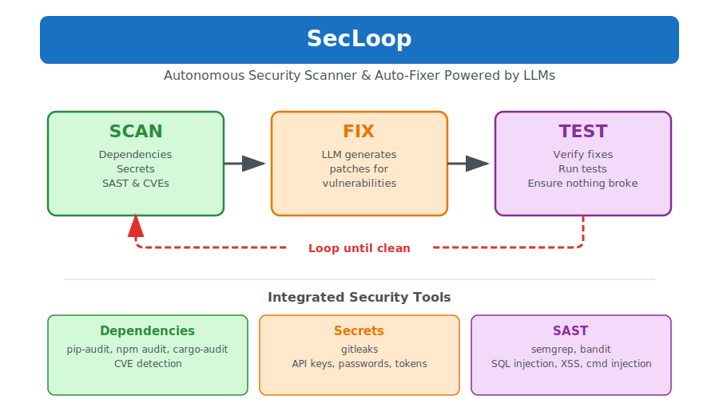

<p align="center">
  
</p>

<h1 align="center">SecLoop</h1>

<p align="center">
  <strong>Autonomous security scanner & auto-fixer powered by LLM loops</strong>
</p>

<p align="center">
  <a href="https://github.com/Nancy-Chauhan/secloop/actions"></a>
  <a href="https://pypi.org/project/secloop/"></a>
  <a href="https://pypi.org/project/secloop/"></a>
  <a href="https://github.com/Nancy-Chauhan/secloop/blob/main/LICENSE"></a>
</p>

<p align="center">
  <a href="#installation">Installation</a> •
  <a href="#quick-start">Quick Start</a> •
  <a href="#usage">Usage</a> •
  <a href="#configuration">Configuration</a> •
  <a href="#ci-cd">CI/CD</a>
</p>

---

## Why SecLoop?

Security vulnerabilities pile up. Dependency updates break things. Manual fixes take hours.

**SecLoop automates it all.** Scan, fix, verify—in a loop until clean.

```bash
$ secloop scan .
Found 14 vulnerabilities in 4 packages

$ secloop run .
✓ All vulnerabilities patched in 1 iteration
```

## Features

| Scanner | What it Detects | Tool |
|---------|-----------------|------|
| Dependencies | CVEs in packages | pip-audit, npm audit, cargo-audit |
| Secrets | API keys, passwords, tokens | gitleaks |
| SAST | SQL injection, XSS, command injection | semgrep, bandit |

**Supported ecosystems:** Python, Node.js, Go, Rust, Ruby

## Installation

```bash
pip install git+https://github.com/Nancy-Chauhan/secloop.git
```

Install the security tools you need:

```bash
pip install pip-audit          # Python dependencies
pip install semgrep bandit     # SAST analysis
brew install gitleaks          # Secret detection
```

## Quick Start

```bash
# Full security audit
secloop audit ./my-project

# Scan dependencies only
secloop scan ./my-project

# Auto-fix vulnerabilities (requires Claude)
secloop run ./my-project
```

## Usage

| Command | Description |
|---------|-------------|
| `secloop scan` | Scan dependencies for CVEs |
| `secloop secrets` | Detect hardcoded secrets |
| `secloop sast` | Static analysis for code vulnerabilities |
| `secloop audit` | Run all scanners |
| `secloop run` | Auto-fix using LLM loops |
| `secloop init` | Create config file |

### Examples

```bash
# Scan with JSON output
secloop scan . --format json

# Scan git history for leaked secrets
secloop secrets . --history

# SAST with OWASP rules
secloop sast . --rules p/owasp-top-ten

# SARIF output for CI/CD
secloop audit . --format sarif > results.sarif

# Auto-fix with iteration limit
secloop run . --max-iterations 5
```

## How It Works

SecLoop uses the **Ralph Loop** pattern—an iterative LLM loop:

<p align="center">
  
</p>

1. **Scan** — Run security tools (pip-audit, semgrep, gitleaks, etc.)
2. **Fix** — LLM generates patches for vulnerabilities
3. **Test** — Verify nothing broke
4. **Repeat** — Loop until all vulnerabilities are fixed

## Configuration

Create `secloop.yaml` in your project:

```yaml
ecosystem: auto
max_iterations: 10

scanners:
  dependencies: true
  secrets: true
  sast: true
```

## CI/CD

### GitHub Actions

```yaml
name: Security Scan
on: [push, pull_request]

jobs:
  security:
    runs-on: ubuntu-latest
    steps:
      - uses: actions/checkout@v4
      - uses: actions/setup-python@v5
        with:
          python-version: '3.12'
      - run: pip install git+https://github.com/Nancy-Chauhan/secloop.git pip-audit
      - run: secloop audit . --format sarif > results.sarif
      - uses: github/codeql-action/upload-sarif@v3
        with:
          sarif_file: results.sarif
```

## Contributing

```bash
git clone https://github.com/Nancy-Chauhan/secloop.git
cd secloop
pip install -e ".[dev]"
pytest
```

## License

MIT License - see [LICENSE](LICENSE) for details.

---

<p align="center">
  Inspired by the <a href="https://ghuntley.com/loop/">Ralph Loop</a> pattern
</p>
